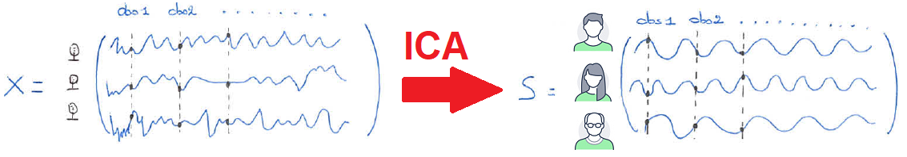
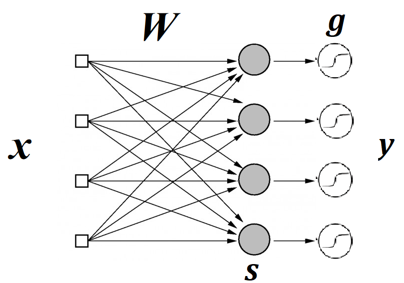

Independent Component Analysis
==============================

This section aims at guiding the user through the different algorithms that are integrated in **stabilized-ICA** to solve the ICA problem. The idea is to provide some mathematical insights about ICA and its solvers so the user can understand better which problem each algorithm actually solves and what are the latent assumptions it makes. The user can choose among several solvers through the `algorithm` parameter of the fit method of `sica.base.StabilizedICA <modules/generated/sica.base.StabilizedICA.html#sica.base.StabilizedICA>`_.

Definition of ICA
-----------------
To define ICA, we use a statistical "latent variables" model (cf. section 2 [1]_). We assume that we observe n linear mixtures :math:`x_1, ... , x_n` of latent sources :math:`s_1,...,s_n`:

.. math:: x_j = a_{j1}s_1 + a_{j2}s_2 + ... + a_{jn}s_n \quad \text{for all j}

It is convenient to use a vector-matrix notation introducing the observed random vector :math:`\boldsymbol{x}  \, \in \, \mathbb{R}^{n}`, the latent random vector :math:`\boldsymbol{s}  \, \in \, \mathbb{R}^{n}` and the unknown mixing matrix :math:`\boldsymbol{A} \, \in \, \mathbb{R}^{n \times n}` :

.. math:: \boldsymbol{x} = \boldsymbol{A} \boldsymbol{s}

Independent component analysis adds three fundamental assumptions to this mixing model [2]_ :

    #. The sources are statistically independent of one another.
    #. The mixing matrix is assumed to be invertible.
    #. The sources have a non-Gaussian distribution, or more precisely, at most one of them can be a Gaussian signal.   

**Note :** Here, we used a squared mixing matrix for simplicity. Please note that this assumption can be relaxed and cases where there are more mixtures than sources still fall into the scope of ICA.   

Since, in general these assumptions do not necessarily hold, we can reformulate the problem saying that the goal is to find the linear transformation :math:`\boldsymbol{A}` so that the observed vector :math:`\boldsymbol{x}` best satisfies the generative model describe above.

Usually, we are dealing with several observations :math:`\boldsymbol{x}^1, ... , \boldsymbol{x}^p` assumed to come from the generative model described above. ICA then takes the following matrix form :

.. math:: \boldsymbol{X} = \boldsymbol{A} \boldsymbol{S} \quad (\text{with } \boldsymbol{X} = \left[ \boldsymbol{x}^1 , ... , \boldsymbol{x}^p \right] \, \in \, \mathbb{R}^{n \times p})

.. _cocktail_ref:

A simple example with the cocktail party problem
_________________________________________________

The cocktail party problem (also called the blind source separation problem) is a classical problem which can be efficiently solved using ICA. It will help us illustrating the mathematical definition of the previous section. 

Let us picture a very small party with three people talking at the same time, and three microphones recording at different places of the room. We can denote the participants :math:`\boldsymbol{x}_1, \boldsymbol{x}_2, \boldsymbol{x}_3` and the microphones :math:`\boldsymbol{s}_1, \boldsymbol{s}_2, \boldsymbol{s}_3`.

Each microphone will record a linear mixture of the voices of the three participants at different times :math:`1, 2, ..., p` (we are dealing with discretized sound signals). Let's now say that you only have access to these recordings (i.e a matrix :math:`\boldsymbol{X} \, \in \, \mathbb{R}^{3 \times p}`) and you want to retrieve the isolated voice of each participant (i.e a matrix :math:`\boldsymbol{S} \, \in \, \mathbb{R}^{3 \times p}`). ICA is particularly well suited to do that, it will retrieve the matrix of independent voices (independent latent sources) :math:`\boldsymbol{S}` as well as the mixing matrix :math:`\boldsymbol{A} \, \in \, \mathbb{R}^{3 \times 3}` which linearly transforms the sources into the mixed recorded signals.

FastICA solver
--------------
The FastICA approach first expresses the ICA problem as the minimization of the mutual information of :math:`n` linear transformations of the observed mixtures :math:`\boldsymbol{x}` :

.. math:: \underset{\boldsymbol{w_1} , ... , \boldsymbol{w_n}}{\min} \, I(y_1 , ... , y_n) \quad (y_1 = \boldsymbol{w_1}^T \boldsymbol{x} , ... , y_n = \boldsymbol{w_n}^T \boldsymbol{x})

This formulation is quite natural since the mutual information is a measure of statistical independence. Thus, solving this minimization problem boils down to finding "maximally independent" sources :math:`s_1 = \boldsymbol{w_{1 ,*}}^{T} \boldsymbol{x} ,..., s_n = \boldsymbol{w_{n , *}}^{T} \boldsymbol{x}`, written as a linear combination of the observed mixtures. This is exactly the ICA problem.

If we constrain the :math:`(y_i)_{i=1}^{n}` to be uncorrelated and of unit variance we can actually simplify the expression of the mutual information using the concept of `negentropy <https://en.wikipedia.org/wiki/Negentropy>`_ :math:`J(y)` (cf section 4 [3]_):

.. math:: I(y_1 , ... , y_n) = Cste - \sum\limits_{i=1}^{n} J(y_i)

**Note :** The negentropy :math:`J(y_i)` can be interpreted as a measure of the non-gaussianity of the random variable :math:`y_i`. Thus the above expression exhibits a clear link between the independence of the latent sources and their non-gaussianity.

With all these assumptions, the FastICA approaches links the ICA problem to the following optimization problem :

.. math::

    \begin{cases}
    & \underset{\boldsymbol{w_1} , ... , \boldsymbol{w_n}}{\max} \, \sum\limits_{i=1}^{n} J(y_i) \\
    & \text{s.t } y_1 , ... , y_n \text{ uncorrelated and of unit variance}
    \end{cases}

Approximation of the negentropy
_______________________________

To compute the negentropy of a random variable :math:`y`, we need its probability density function (pdf). For ICA, knowing the pdfs of each :math:`y_i` would mean that we have access to the probability distributions of the latent sources :math:`s_i , ... , s_n`. Unfortunatly, this is usually not the case. We thus need to build a simple and accurate estimator of negentropy (this is not an easy task at all !).

In [4]_, Hyvärinen adressed this challenge and improved the classical estimation methods that were using higher-order moments and thus were sensible to outliers and mainly considering the tails of the distributions. 

The idea is to assume that we actually have access to some information about the density of :math:`y` through the expectations of measuring functions, i.e :math:`\mathbb{E}(G_i(y))`. Though this is not sufficient by itself to estimate the density :math:`f(y)` and consequently the negentropy, we can add a `maximum entropy argument <https://en.wikipedia.org/wiki/Principle_of_maximum_entropy>`_ as well as some simplifying assumptions to obtain an estimate :math:`\hat{f}(y)` (see sections 3, 4 [4]). All that remains is to integrate :math:`\hat{f}(y)` in the expression of the negentropy and obtain : 

.. math:: J_G (y) \propto \left( \mathbb{E} \left[ G(y) \right] - \mathbb{E} \left[ G( \nu ) \right] \right)^{2} \quad ( \nu \sim \mathcal{N}(0 , 1))

**Note :** In practice the term :math:`\mathbb{E} \left[ G(y) \right] = \mathbb{E} \left[ G(\boldsymbol{w}^T \boldsymbol{x}) \right]` will be computed with an empirical mean over the different observations :math:`\boldsymbol{X} = \left[ \boldsymbol{x}^1 , ... , \boldsymbol{x}^p \right]` we will have access to.

In a nutshell, this approximation :math:`J_G` gives a us a new optimization problem (replacing :math:`J(y_i)` by :math:`J_G(y_i)` in the previous section) which the FasICA approach will try to deal with to solve ICA. 

Practical choice for the measuring function G
_____________________________________________

An important remaining question that is actually let to the user in FastICA is the practical choice of the measuring function :math:`G`. Several criteria must be emphasized :

    #. The empirical estimation of :math:`\mathbb{E} \left[ G(y) \right]` should not be statistically difficult (i.e not too sensitive to outliers). In practice it means that :math:`G` should not grow too fast when :math:`|y|` grows.
    #. :math:`G` should capture aspects of the true distribution :math:`f(y)` that are pertinent in the computation of the negentropy. Ideally, if we knew the distribution :math:`f(y)` we would choose :math:`G_{opt}(y) = - \log f(y)`.

The second criteria is the most difficult to satisfy. It requires the user to have some prior knowledge or at least an intuition about what the shape of the distributions of the independent sources should be. It is, thus, very much an application-dependent question. However, Hyvärinen still provided three possibilities for the function :math:`G` that gave satisfying experimental results for many applications. They are accessible through the `fun` parameter of the fit method of `sica.base.StabilizedICA <modules/generated/sica.base.StabilizedICA.html#sica.base.StabilizedICA>`_ (only when the `algorithm` parameter is set to `'fastica_par'` or `'fastica_def'`).

    * `fun = 'logcosh'` is associated with a differentiable version of :math:`G(u) = |u|` which codes for a **super-Gaussian** distribution (:math:`f(u) \propto \exp (k |u|))`. This is claimed to be a good general-purpose choice for the function :math:`G`.
    * `fun = 'exp'` is associated with a differentiable version of :math:`G(u) = |u|^{\alpha}` (with :math:`\alpha << 1`). It is recommended when independent sources are assumed to be **highly super-Gaussian** or when robustness to outliers is very important.
    * `fun = 'cube'` is associated with :math:`G(u) = \frac{1}{4} u^4` (this is a bit misleading). This choice does not satisfy all the optimal criteria for the choice of :math:`G` (in particular it grows too fast when :math:`|y|` grows). It can still be used for estimating **sub-Gaussian** sources and when there is no outliers.

**Note** : The user can also provides its own measuring function :math:`G` if he has any prior knowledge or intiution about the shape of the distribution of the sources. In that case, he could use :math:`G(u) = - \log f_{prior}(u)`. He would still have to pay attention to the criteria that Hyvärinen defined for the choice of :math:`G`. Please refer to the documentation of `sklearn.decomposition.FastICA <https://scikit-learn.org/stable/modules/generated/sklearn.decomposition.FastICA.html>`_ for more details.

A fixed-point algorithm
_______________________

In order to complete the FastICA approach, we finally need and efficient algorithm for solving the approximate optimization problem we derive in the previous sections. A gradient descent scheme could absolutly work but it would require tuning the learning rate to ensure and speed up the convergence. Hyvärinen proposed instead a fixed-point strategy. 

We can briefly detail the principles of such an algorithm using the more simple task of finding a single independent component :math:`\boldsymbol{w}_*^T \boldsymbol{x}`. It writes very similarly to the previous optimization problem except that :math:`\sum\limits_{i=1}^{n} J_G(\boldsymbol{w_i}^T \boldsymbol{x})` is replaced by a single term :math:`J_G(\boldsymbol{w}^T \boldsymbol{x})`.

.. math::

    \begin{cases}
    & \underset{\boldsymbol{w}}{\max} \, J_G(y_i) = \underset{\boldsymbol{w}}{\max} \, J_G(\boldsymbol{w}^T \boldsymbol{x})\\
    & \text{s.t } ||\boldsymbol{w}||^2 = 1
    \end{cases}

Using the `Kuhn-Tucker conditions <https://en.wikipedia.org/wiki/Karush%E2%80%93Kuhn%E2%80%93Tucker_conditions>`_ , it can be shown that if we assume that a solution to this optimization problem exists then we can find it by solving the following equation (section IV.B [5]_) :

.. math :: h(\boldsymbol{w}) = \nabla J_G(\boldsymbol{w}) - \beta \nabla \left( ||\boldsymbol{w}||^2 - 1 \right) = 0 \quad \text{ (with } \beta \text{ a specific constant)}

To solve such an equation and find the zero :math:`\boldsymbol{w}_*` of the function :math:`h(\boldsymbol{w})` we can use a simple `Newton's scheme <https://en.wikipedia.org/wiki/Newton%27s_method>`_ (with some additional simplifying approximations). This algorithm has been shown to converge under the ICA assumptions with a quadratic speed (as usual with Newton's method) [5].

Finally, the only question that remains to be adressed is : How can we use the solving method detailed above for one single component to solve the complete ICA problem with several independent components :math:`\boldsymbol{w}_{1 , *}^T\boldsymbol{x} , ... , \boldsymbol{w}_{n , *}^T\boldsymbol{x}` ? Hyvärinen proposed two strategies, which are accessible through the `algorithm` parameter of the fit method of `sica.base.StabilizedICA <modules/generated/sica.base.StabilizedICA.html#sica.base.StabilizedICA>`_.

    * `algorithm = 'fastica_def'` refers to a deflation scheme, i.e the independent components are estimated one by one with the Newton's method presented above and they are "decorrelated" after each iteration to prevent different solving from converging to the same component (see section 6.2 [3] , section IV.C [5]). 
    * `algorithm = 'fastica_par'` refers to a symmetric decorrelation scheme which finds all the components at the same time (please refer to equation (65) of [3] or section IV.C [5] for more details).

**Note :** The implementation of 'fastica_par' in `sklearn.decomposition.FastICA <https://scikit-learn.org/stable/modules/generated/sklearn.decomposition.FastICA.html>`_ involves the inversion of a matrix. Thus some numerical instabilities may lead to some convergence error (we adressed this problem in `sica.base.StabilizedICA` by re-running the algorithm several times in case of failure).

Infomax solver
--------------
The infomax approach was first developed by Bell and Sejnowski in [1]. Originally, it is presented as an unsupervised strategy to learn a "good" representation of an input :math:`\boldsymbol{x}` with a single-layer feed forward neural network with non-linear activation (cf figure below).

.. math::

    \begin{equation}
        \begin{cases}
        & \boldsymbol{y} = \boldsymbol{g} \left( \boldsymbol{W} \boldsymbol{x} \right) \\
        & \boldsymbol{W} \, \in \, \mathbb{R}^{n \times n}  \, , \, \boldsymbol{x} \, \in \, \mathbb{R}^n \, , \,  \boldsymbol{y} \, \in \, \mathbb{R}^n \, , \, \boldsymbol{g} : \mathbb{R}^n \longrightarrow \mathbb{R}^n
        \end{cases}
    \end{equation}

A "good" representation is defined using an information theoretic criteria : :math:`\boldsymbol{W^*}` maximizes the mutual information between the output :math:`\boldsymbol{y}` and the input :math:`\boldsymbol{x}`.

The question that Bell and Sejnowski adressed in their paper was : Under which conditions and for which choice of the non-linearity :math:`\boldsymbol{g}` does the infomax problem solve ICA and ensure maximally independent sources :math:`\boldsymbol{s}` ?

They proposed a non-linearity :math:`\boldsymbol{g} = (g_1, ... , g_n)^{T}` with each :math:`g_i` being the cumulative distribution function of some density :math:`f_i`. For this choice, they showed that solving the infomax problem boiled down to minimize the mutual information of the sources :math:`s_1, ... , s_n`.

.. math::

    \begin{equation}
        \boldsymbol{W^*} = \underset{\boldsymbol{W}\, \in \, \mathbb{R}^{n \times n}}{argmax} - KL(\boldsymbol{W}\boldsymbol{x} || \boldsymbol{\tilde{s}}) = \underset{\boldsymbol{W}\, \in \, \mathbb{R}^{n \times n}}{argmax} - I(s_1 , ... , s_n) \quad \text{(where } \boldsymbol{\tilde{s}} \sim f_1 \times ... \times f_n )
    \end{equation}

In other words, solving the infomax problem with this specific non-linearity allows us to maximize the independence of the sources and get as close as possible (in the sense of KL divergence) to a target distribution :math:`\boldsymbol{\tilde{s}} \sim f_1 \times ... \times f_n`.

Maximum-likelihood approach and picard python package
_____________________________________________________

In [6]_ Jean-François Cardoso proposed a maximum-likelihood formulation for the ICA problem and showed that it was equivalent to the infomax approach described above.

Similarly to the precedent approach, we assume the marginal densities of the independent sources :math:`f_i` to be known and, under the independence hypothesis, we can write the negative log-likelihood associated with the observations and minimize it :

.. math::

    \begin{equation}
    \boldsymbol{W^*} = \underset{\boldsymbol{W}}{argmin} \, \mathcal{L} (\boldsymbol{W} ; (f_i)_{i=1}^n)
    \end{equation}

**Note :** We purposely wrote :math:`\mathcal{L} (\boldsymbol{W} ; (f_i)_{i=1}^n)` instead of :math:`\mathcal{L} (\boldsymbol{W})` to insist on the fact that this algorithm requires the choice of the marginal densities :math:`(f_i)_{i=1}^n`.

The infomax ICA approach thus deeply depends on the choice of the source model (i.e choice and/or estimation for :math:`f_i`). For a model that captures the "true" densities of the sources, the local convergence of the infomax method is guaranteed. However, it is unclear what happens with a wrong source model. Many articles stated that this approach is fairly robust to misspecifying source distributions and that it should be enough to estimate whether the sources are sub- or super-Gaussian.

In [7]_ and [8]_, Pierre Ablin *et al.* developed a very promising second-order scheme to solve the infomax problem through the minimization of the negative log-likelihood. It is implemented in the python package `picard <https://pierreablin.github.io/picard/>`_ . This algorithm is fast and accurate, two essential properties for its integration in the fit method of `sica.base.StabilizedICA <modules/generated/sica.base.StabilizedICA.html#sica.base.StabilizedICA>`_. Besides, it is claimed to achieve a kind of convergence (in the sense of gradient decrease) even when applied to real data for which ICA assumptions do not hold exactly.

In the `picard <https://pierreablin.github.io/picard/>`_ package, several variants of the algorithm are implemented. They are accessible through the `algorithm` parameter of the fit method of `sica.base.StabilizedICA <modules/generated/sica.base.StabilizedICA.html#sica.base.StabilizedICA>`_.

    * `algorithm = 'infomax'` refers to the basic implementation of infomax through maximum-likelihood using Pierre Ablin's algorithm [7].
    * `algorithm = 'infomax_ext'` refers to an extension of the infomax approach that can deal with a mixture of super-Gaussian and sub-Gaussian sources [9]_. 
    * `algorithm = 'infomax_orth'` refers to a constrained version of the original picard algorithm that forces the sources to be uncorrelated [8].
    * `algorithm = 'fastica_picard'` refers to a mix of 'infomax_ext' and 'infomax_orth' that was shown to converge towards the fixed points of the well-known FastICA algorithm (it is claimed to be faster than FastICA on real data [6]).

.. topic:: References:

    .. [1] : Anthony J. Bell and Terrence J. Sejnowski. An information-maximization approach to blind separationand blind deconvolution.Neural Comput., 7(6):1129–1159, November 1995 
    .. [2] : Pierre Comon, Independent component analysis, A new concept?,Signal Processing, Volume 36, Issue 3, 1994, Pages 287-314, ISSN 0165-1684, https://doi.org/10.1016/0165-1684(94)90029-9.  
    .. [3] : A. Hyvärinen and E. Oja. Independent Component Analysis: Algorithms and Applications. Neural Networks, 13(4-5):411-430, 2000. 
    .. [4] : A. Hyvärinen. New Approximations of Differential Entropy for Independent Component Analysis and Projection Pursuit.  In Advances in Neural Information Processing Systems 10 (NIPS*97), pp. 273-279, MIT Press, 1998
    .. [5] : A. Hyvärinen. Fast and Robust Fixed-Point Algorithms for Independent Component Analysis. IEEE Transactions on Neural Networks 10(3):626-634, 1999.
    .. [6] : J. F. Cardoso. Infomax and maximum likelihood for blind source separation.IEEE Signal ProcessingLetters, 4(4):112–114, 1997.
    .. [7] : P. Ablin, J. Cardoso, and A. Gramfort. Faster independent component analysis by preconditioning withhessian approximations.IEEE Transactions on Signal Processing, 66(15):4040–4049, 2018.
    .. [8] : P. Ablin, J. Cardoso, and A. Gramfort. Faster ica under orthogonal constraint. In2018 IEEE InternationalConference on Acoustics, Speech and Signal Processing (ICASSP), pages 4464–4468, 2018.
    .. [9] : Te-Won Lee, Mark Girolami, and Terrence Sejnowski. Independent component analysis using an extended infomax algorithm for mixed sub-gaussian and super-gaussian sources.Neural Computation, 11:417–441,02 1999.