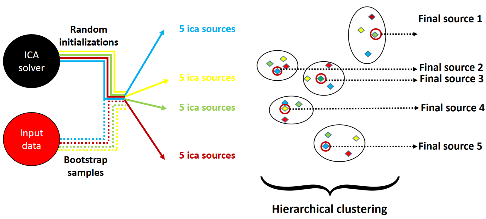
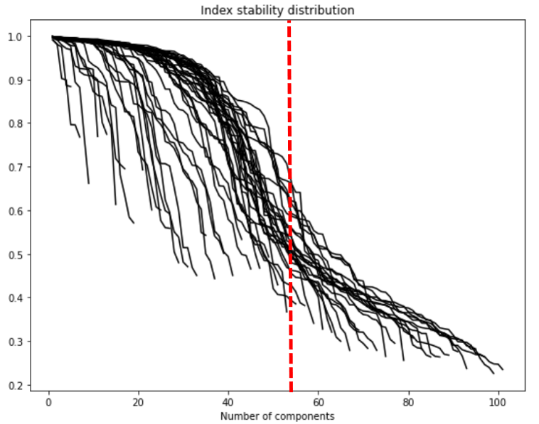

Icasso algorithm
================

The main algorithm of **stabilized-ica**, `sica.base.StabilizedICA <modules/generated/sica.base.StabilizedICA.html#sica.base.StabilizedICA>`_, solves the ICA problem 
and stabilizes the resulting components through multiple runs of the ICA solver and a final aggregation step. Our implementation is mainly based on the Icasso method 
which was developped by J. Himberg and A. Hyvarinen in 2003 [1]_. There are three main steps : 

   #. An ICA solver is chosen and its hyperparameters are fixed. The user also sets the number of components to extract (we will call it `n_components`). Then, the solver is run `n_runs` times with different initial conditions and, optionally, with different bootstrap samples of the original data set. At the end, `n_components*n_runs` are extracted.   

   #. The `n_components*n_runs` components are clustered into `n_components` clusters using hierarchical agglomerative clustering with average linkage criterion. The similarity metric is the absolute value of the pearson correlation coefficient between estimates of the ICA components.   

   #. Finally, the centrotype of each cluster is computed and returned as a stabilized independent component. The centrotype is the point in the cluster which has the maximum sum of similarities to other points in the cluster. Besides, for each cluster, an index which quantifies its compactness and isolation is computed in order to assess the quality of the associated stabilized components (i.e its centrotype). It is computed as the difference between the average intra-cluster similarities and average extra-cluster similarities.

   Illustration of the Icasso method with `n_runs = 4` and `n_components = 5`.

Stability of the final components
---------------------------------
This algorithm gives us a way to measure the reliability of the ICA components [1] , [2]_. Intuitively, if an ICA component is reliable it should be estimated at every run of the Icasso method and should be associated with a tight cluster at the end. Thus we can assess the stability of a component generated by the Icasso algorithm by measuring the "tightness" of its associated cluster of `n_runs` components. For a given final ICA source :math:`m` and its associated cluster :math:`C_m` we compute its stability index :math:`I_q(C_m)` :

.. math:: I_q (C_m) = \underbrace{\dfrac{1}{|C_m|^2} \sum_{i , j \in C_m} \sigma_{ij}}_{\text{mean intra-cluster similarity}} - \underbrace{\dfrac{1}{|C_m||C_{-m}|} \sum_{i \in C_m} \sum_{j \in C_{-m}} \sigma_{ij}}_{\text{mean extra-cluster similarity}} \quad \in \quad [0 ,1]

where :math:`|C_m|` corresponds to the number of points in the clusters, :math:`|C_{-m}|` corresponds to the number of points outside the cluster and :math:`\sigma_{ij}` corresponds to the similarity between components i and j (i.e absolute value of Pearson correlation).

This stability index can measure the robustness of the ICA components with respect to two main uncertainty sources :

   * The **algorithmic uncertainty** is measured through the multiple runs of the chosen ICA solver with different random initializations.     
   * The **statistical uncertainty** is measured through the multiple runs of the chosen ICA solver with different bootstrap samples as input.

This measure of stability allows us to rank the final ICA components extracted with Icasso. Besides, it brings the light on the ICA estimates that most likely relate to meaningful and interpretable latent sources. On the contrary, the most unstable estimates are likely to correspond to noisy directions that could originate from diverse sources such as numerical instabilities, the ICA model inadequacy for our real data, or statistical limitations due to a small sample size.

Choice of the number of components
----------------------------------
The choice of the number of ICA components to extract is a crucial step but yet very difficult. Indeed, contrary to PCA, the choice of the order of decomposition may have an impact on all the extracted ICA components. When going from k components to k+1, there is no guarantee that the k first components will remain the same. Actually, it has been noticed that a choice of too few ICA components could lead to "fused components" that would not capture the heterogeneity of the data (under-decomposition) whereas a choice of too many components could lead to noisy "splitted components" (over-decomposition).

The choice of the order of decomposition relates to the determination of the intrinsic data dimension. Many methods address this question (ex: using PCA and the Kaiser rule) but a few are specific to ICA. In [3]_ U. Kairov et al. empirically developped a method for choosing an optimal number of components. In particular they showed that, for gene expression data, this method led to more interpretable and more reproducible components. Their protocol relies on the natural ranking that stabilized ICA offers through the stability index associated to each component. It could be roughly summarized with two steps:

   * For a number of extracted components varying between :math:`n_{min}` and :math:`n_{max}` (ex: :math:`n_{min} = 2 ,3 , ... , n_{max} = 100`), they run the stabilized ICA algorithm and plot the associated stability profile (i.e the stability indexes of the components ordered from the most stable to the least one). At the end, within a single plot they obtain several stability profiles, associated to different orders of decomposition (cf figure below).
   * Looking at these stability profiles, they try to select a sufficiently large number of components to capture the information contained in the original data set, but small enough to avoid producing an excessive amount of highly unstable components. With their experiments with gene expression data sets, they noticed that an inflection point in the distribution of the stability profiles often offers such a satisfying trade-off.

The module `sica.base.MSTD <modules/generated/sica.base.MSTD.html#sica.base.MSTD>`_ allows the user to plot the stability profiles for several orders of decomposition. It offers an insightful visualization tool to select a relevant number of ICA components to extract, using the reasoning described above. 

**Note 1:** There is no guarantee to obtain a distribution of stability profiles similar to the figure above or to those plotted in [3]. This very much depends on the data and the choice of hyperparameters for the ICA solver. However the philosophy of the method developped in [3] remains the same : the plot of this distribution should help you finding a satisfying compromise between many components and a high overall stability.

**Note 2:** Many other methods could be used to infer the intrinsic dimension of a data set and selecting a relevant number of components before using **stabilized-ica**. We advise the user to explore the `scikit-dimension package <https://scikit-dimension.readthedocs.io/en/latest/>`_ . 

.. topic:: References:

    .. [1] : J. Himberg and A. Hyvarinen, "Icasso: software for investigating the reliability of ICA estimates by clustering and visualization," 2003 IEEE XIII Workshop on Neural Networks for Signal Processing (IEEE Cat. No.03TH8718), 2003, pp. 259-268, doi: 10.1109/NNSP.2003.1318025.
    .. [2] : F. Meinecke, A. Ziehe, M. Kawanabe and K.-R. Müller, “Estimating the Reliability of ICA Projections,” in Advances in Neural Information Processing Systems 14, MIT Press, 2002.
    .. [3] : Kairov U, Cantini L, Greco A, Molkenov A, Czerwinska U, Barillot E, Zinovyev A. Determining the optimal number of independent components for reproducible transcriptomic data analysis. BMC Genomics. 2017 Sep 11;18(1):712. doi: 10.1186/s12864-017-4112-9. PMID: 28893186; PMCID: PMC5594474.
