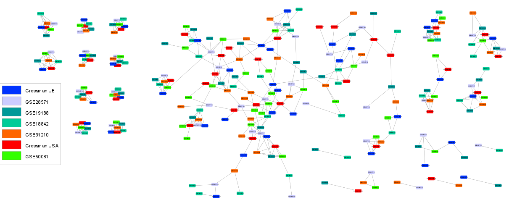

Mutual Nearest Neighbors method
===============================
In many applications, one interesting question is: Are the stabilized ICA components extracted from one data set reproducible over several data sets ? For instance, working on a gene expression data set with samples associated to a specific disease, it may be worth wondering whether the extracted ICA components are reproducible for heatlhy samples or not.

A meta-analysis with several data sets is required to address such a question. The idea would be to extract the stabilized ICA components for each data set, and then identify those that are reproducible over several data sets. 

The Reciprocal Best Hits method
-------------------------------
One of the most natural method to do that in practice is called Reciprocal Best Hits (RBH). It was first developped to find orthologous genes among different species (i.e genes in different species that originated by vertical descent from a single gene of the last common ancestor). 

The RBH method relies on a simple rule. For two components :math:`x_i^{1}` and :math:`x_j^{2}` extracted from data sets :math:`\mathcal{D}_1` and :math:`\mathcal{D}_2`, we consider that they are linked if :math:`x_j^{2}` is the nearest neighbor of :math:`x_i^{1}` among the points of :math:`\mathcal{D}_2` and :math:`x_i^{1}` is the nearest neighbor of :math:`x_j^{2}` among the points of :math:`\mathcal{D}_1`. Applying this rule for every component of each data set, we obtain a graph whose nodes represent the different components and edges highlight their reproducibility accross data sets.

**Note :** The RBH method can deal with any metric. However for stabilized ICA components it seems quite natural to use a correlation metric (i.e :math:`1 - |\rho_{ij}|`) since they can be interpreted as finite samples from latent distributions. By default, `sica.mutualknn.MNNgraph <modules/generated/sica.mutualknn.MNNgraph.html#sica.mutualknn.MNNgraph>`_ uses the Pearson correlation coefficients.

An illustration of the RBH method with gene expression data
-----------------------------------------------------------
The following figure shows a `cytoscape <https://cytoscape.org/>`_ visualization of a RBH graph obtained for seven different lung cancer gene expression data sets. First, we applied `sica.base.StabilizedICA <modules/generated/sica.base.StabilizedICA.html#sica.base.StabilizedICA>`_ on each data set. Then the RBH graph was computed with `sica.mutualknn.MNNgraph <modules/generated/sica.mutualknn.MNNgraph.html#sica.mutualknn.MNNgraph>`_ . Each node corresponds to an extracted stabilized ICA component and each color is associated to a specific data set. 

We observe, on the left of the graph, several tight, isolated and fully connected communities with one component per data set. Such a topology may indicate reproducible biological signals, present in all the data sets.

A natural extension of RBH: the mutual nearest neighbors method
---------------------------------------------------------------
The mutual k-nearest neighbors approach offers a straightforward extension to the RBH method described above. Indeed, it simply consists in considering the reciprocal members of the k-nearest neighborhood rather than only the reciprocal nearest neighbors. The module **sica.mutualknn** allows the user to set the metric as well as the parameter k. When k=1, this is equivalent to the RBH approach.

The following figure illustrates the building of a mutual nearest neighbors graph with k=2 and two different data sets A and B. An edge will be drawn between two components :math:`x_A` and :math:`x_B` from A and B if and only if :math:`x_A` belongs to the 2-nearest neighborhood of :math:`x_B` (only considering points of A) and vice versa.

   Comparison of two situations for the building of the mutual k-nearest neighbors graph (k=2)

**Note :** The mutual k-nearest neighbors approach is an extension of the classical k-nearest neighbors method. It seems to date back to the early eighties in the context of clustering [1]_. Nowadays, it is growing more and more popular and emerges as a performing alternative to k-nearest neighbors in many machine learning algorithms. In particular, it is claimed to reduce the effect of hubness in high dimension. However, to our knowledge, the theoretical properties of such a method are not yet fully understood. Thus, you shoud choose a metric and a value for k wisely and interpret the resulting graph with care.

.. topic:: References:

    .. [1] : K. Chidananda Gowda and G. Krishna. Agglomerative clustering using the concept of mutual nearest neighbourhood. Pattern Recognition, 10(2):105–112, 1978.
