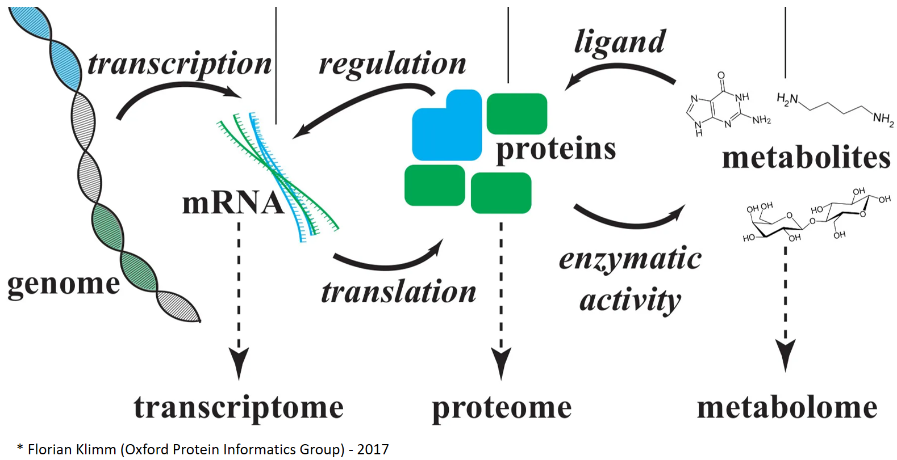
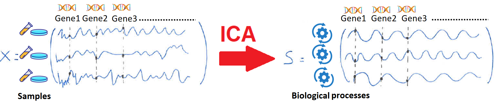
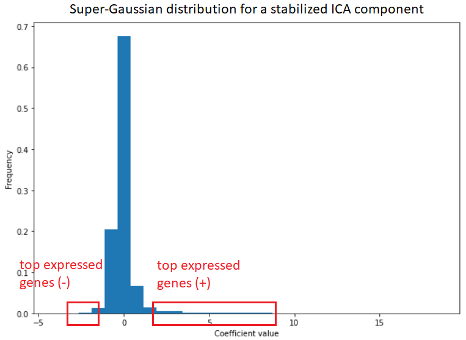
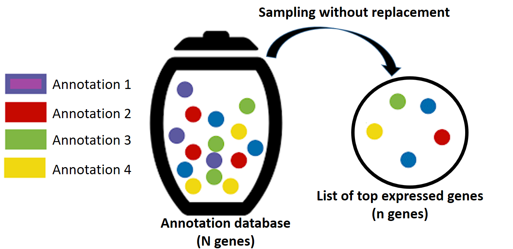
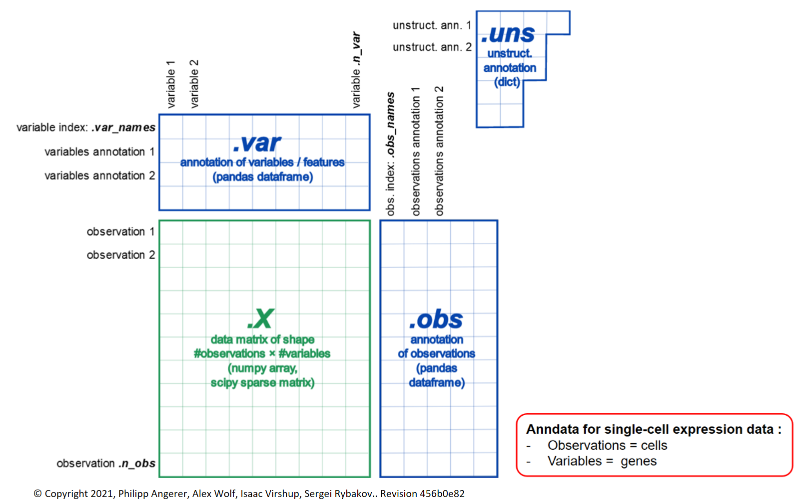

Omics data analysis
===================
**stabilized-ica** was originally developped to provide a reproducible and biologically meaningful python algorithm for the deconvolution of omics data. Several modules like `sica.singlecell <modules/generated/sica.singlecell.ica.html#sica.singlecell.ica>`_ or `sica.annotate <modules/classes.html#sica-annotate-biological-annotation-of-ica-components>`_ are specifically dedicated to this type of data. However, we paid attention to provide versatile algorithms for the computation of stabilized ICA components and for the mutual k-nearest neighbors method, that can deal with many other data types.

This section aims at providing the user some insights about the analysis of omics data with **stabilized-ica**. We will explain why ICA is relevant for deciphering the complexity of omics data and describe the tools we implemented in **stabilized-ica** to do so.

   
   Illustration of the most widely studied omics data types (genomics, transcriptomics, proteomics and metabolomics).

**Note :** For a complete review of the application of ICA to omics data, we recommend the user to refer to the article of N. Sompairac *et al.* (2019) [1]_ .

Omics data as linear mixture of latent biological signals
---------------------------------------------------------
Omics analyses often come with complex and high-dimensional data (ex: transcritpomics data :math:`\sim 10^4`) which need to be carefully processed in order to extract relevant biological information. Indeed, the raw data offer a blurry quantification of underlying biological mechanisms that is often altered by technical noises and high redundancies between features. It is believed that such data actually live on a low-dimensional subspace entirely characterized by different biological processes.
Besides, from a more technical point of view, high-dimensional omics data often come with a low sample size which induces many statistical and computational challenges (ex: over-fitting in supervised learning, curse of dimensionality...).

Thus, developing efficient and biologically relevant dimensionality reduction techniques is a crucial challenge for omics data. Matrix factorization methods such as PCA (Principal Component Anlysis), NMF (Non-negative Matrix Factorization) or ICA offer a simple framework to perform such dimensionality reduction. They assume that the observations of a measurable quantity (ex: the expression of a single gene) result from linear combinations of latent components.
ICA adds a constraint of statistical independence for these components which seems quite natural.

**Note :** A large majority of the applications of ICA to omics data deals with transcriptomics, probably because many tools exist for the interpretation of the extracted components. However, ICA has also been applied to other omics levels such as proteomics or methylation profiles.

A parallel with deconvolution of sound signals
______________________________________________
Drawing a parallel with the deconvolution of sound signals may help to get a better intuition about the application of ICA to omics data. 

Let us suppose that we deal with a transcriptomic data set :math:`X \, \in \, \mathbb{R}^{n \times p}` with :math:`n` samples and :math:`p` genes. First, we can interpret each biological sample as a measurement of a complex biological signal, discretized with the observation of p genes.
Then, we can make the assumption that each of these biological signals actually results from a linear combination of underlying simpler and independent biological sources. We are exactly in the same situation as the one described in the :ref:`cocktail party example <cocktail_ref>` (replacing microphones by biological samples and time points by genes) and ICA is thus particularly suited to solve such a problem.

Enrichment analysis for annotating components
---------------------------------------------
Let us now focus on transcriptomic data (i.e gene expression data) and the tools that **stabilized-ica** provides to biologically annotate the associated ICA components. These tools are gathered in the `sica.annotate <modules/classes.html#sica-annotate-biological-annotation-of-ica-components>`_ module. 

Extraction of the top expressed genes
_____________________________________
A key property of ICA is the assumption of non-Gaussianity for the independent sources : the solver will look for super-Gaussian or sub-Gaussian distributions. In particular, if we assume and impose the sources to be mainly super-Gaussian (see the `Independent Component Analysis section <ICA.html>`_) we can take advantage of the shapes of the extracted ICA components (i.e high peak and heavy tails) to provide some meaningful biological annotations for each of them.

In order to simply describe how it works, let us go back to the example of the previous section. Applying stabilized ICA, we obtain several components :math:`s_j \, \in \, \mathbb{R}^{p}` (i.e the rows of matrix S) which can be seen as finite p-samples of latent independent distributions. If we plot the empirical distribution of :math:`s_j`, we observe as expected, a high peak at zero as well as few extreme values. It means that most of the original genes are associated to near-zero values and only a few are associated to large values (in terms of absolute value). Thus, we can retrieve the small subset of genes associated to the largest values and use them to biologically characterize :math:`s_j`.

The tools `sica.annotate.reactome.ReactomeAnalysis <modules/generated/sica.annotate.reactome.ReactomeAnalysis.html#sica.annotate.reactome.ReactomeAnalysis>`_ and `sica.annotate.toppfun.ToppFunAnalysis <modules/generated/sica.annotate.toppfun.ToppFunAnalysis.html#sica.annotate.toppfun.ToppFunAnalysis>`_ give the user several strategies for selecting the top expressed genes of each ICA component :

   * The `tail` parameter allows the user to choose whether he wants to select the top expressed genes of the positive tail only, of the negative tail only, of both or of the heaviest one only.
   * The `method` parameter allows the user to choose whether he wants to use a threshold based on the quantile of the empirical distribution (i.e select genes above and/or under a certain quantile) or based on its standard deviation (i.e select genes above :math:`\mu + k \sigma` and/or under :math:`\mu - k \sigma`).

**Note 1 :** The ICA sources can be recovered up to some trivial transformations (i.e scaling, permutation, sign change). Thus the sign of the coefficients associated to each gene is actually quite difficult to interpret. Selecting the top genes from both tails or from the heaviest one may be more reasonable choices if there is no complementary information that could favor the positive over the negative tail or vice versa.

**Note 2 :** With the `top_genes_` attribute you can have access to the list of top expressed genes for each extracted ICA components.

Enrichment analysis with Reactome and ToppFun
______________________________________________
Once the list of top expressed genes has been retrieved, we can perform functional enrichment analysis to identify known biological annotations that are significantly over-represented in this list.

Two annotation databases are accessible via **stabilized-ica** : `Reactome database <https://reactome.org/>`_  and `ToppFun database <https://toppgene.cchmc.org/>`_. They both use an `hypergeometric test <https://en.wikipedia.org/wiki/Hypergeometric_distribution#Hypergeometric_test>`_ to assess whether their annotations are significantly over-represented. The null hypothesis of this test states that, for a given annotation, the observed number of genes that are associated with it in our list of :math:`n` top expressed genes results from :math:`n` independent draws without replacement from a huge list of :math:`N` genes (each one associated to different annotations). This observed number of genes follows an hypergeometric law.

   A schematic view of the null hypothesis for the enrichment analysis of our list of top expressed genes

For a given annotation :math:`j`, we denote by :math:`k_j` the number of genes associated to it in our list of :math:`n` top expressed genes. We also denote by :math:`N` the total number of genes contained in the annotation data base we are working with and by :math:`M_j` the number of those :math:`N` genes associated to the annotation :math:`j`. Under the null hypothesis, :math:`k_j` follows a hypergeometric law, represented by the random variable :math:`X_j`. The :math:`p_{\text{value}}` of the hypergeometric test is thus computed with :

.. math:: p_{\text{value}} = \mathbb{P}(X_j \geq k_j) = 1 - \sum\limits_{i = 1}^{k_j} \dfrac{\binom{M_j}{i}\binom{N - M_j}{i}}{\binom{N}{n}}

**Note 1 :** Both annotation databases provide correction for multiple testing. ToppFun uses `Bonferonni <https://en.wikipedia.org/wiki/Bonferroni_correction>`_, `Benjamini-Hochberg <https://en.wikipedia.org/wiki/False_discovery_rate#Benjamini%E2%80%93Hochberg_procedure>`_ and `Benjamini-Yekutieli <https://en.wikipedia.org/wiki/False_discovery_rate#Benjamini%E2%80%93Yekutieli_procedure>`_ procedures while Reactome only uses Benjamini-Hochberg procedure (Entities FDR).

**Note 2 :** A wide range of analyses could be performed on top of/instead of this simple annotation process to gain more insights about the biological meaning of the extracted ICA components. The strategy implemented in **stabilized-ica** will roughly highlight the components that could be relevant, but this will not be enough to have a deep understanding of your transcriptomic data set. At one point, diving into the list of the top expressed genes of each component will be needed.

Single-cell data
----------------
**stabilized-ica** provides a function `sica.singlecell.ica <modules/generated/sica.singlecell.ica.html#sica.singlecell.ica>`_ to deal with `single-cell gene expression data <https://en.wikipedia.org/wiki/Single_cell_sequencing>`_. In particular, it deals with single-cell gene expression data built with `anndata format <https://anndata.readthedocs.io/en/latest/anndata.AnnData.html>`_ (i.e Annotated data). To do so, sica.singlecell.ica mimics the function `scanpy.pp.pca <https://scanpy.readthedocs.io/en/stable/generated/scanpy.pp.pca.html>`_ from the `scanpy package <https://scanpy.readthedocs.io/en/stable/>`_ which is widely used for analyzing single-cell data.

   AnnData for single-cell expression data

.. topic:: References:

    .. [1] : Sompairac N, Nazarov PV, Czerwinska U, Cantini L, Biton A, Molkenov A, Zhumadilov Z, Barillot E, Radvanyi F, Gorban A, Kairov U, Zinovyev A. Independent Component Analysis for Unraveling the Complexity of Cancer Omics Datasets. Int J Mol Sci. 2019 Sep 7;20(18):4414. doi: 10.3390/ijms20184414. PMID: 31500324; PMCID: PMC6771121.